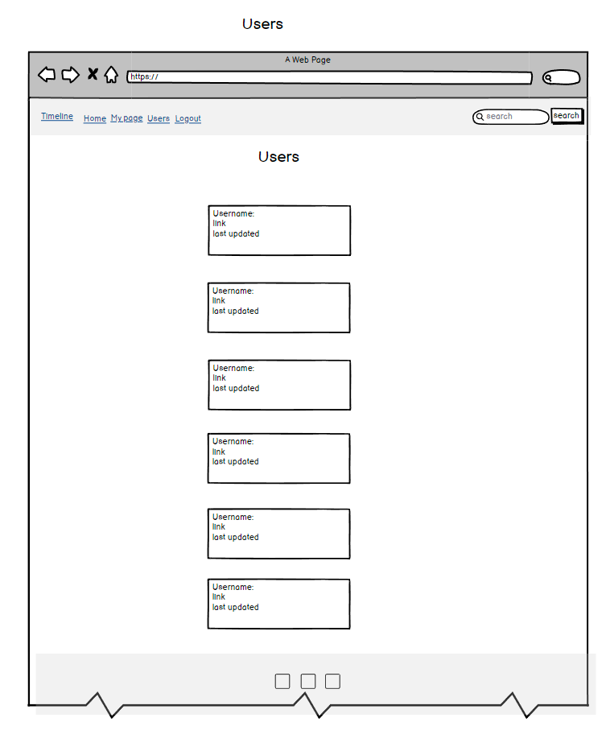
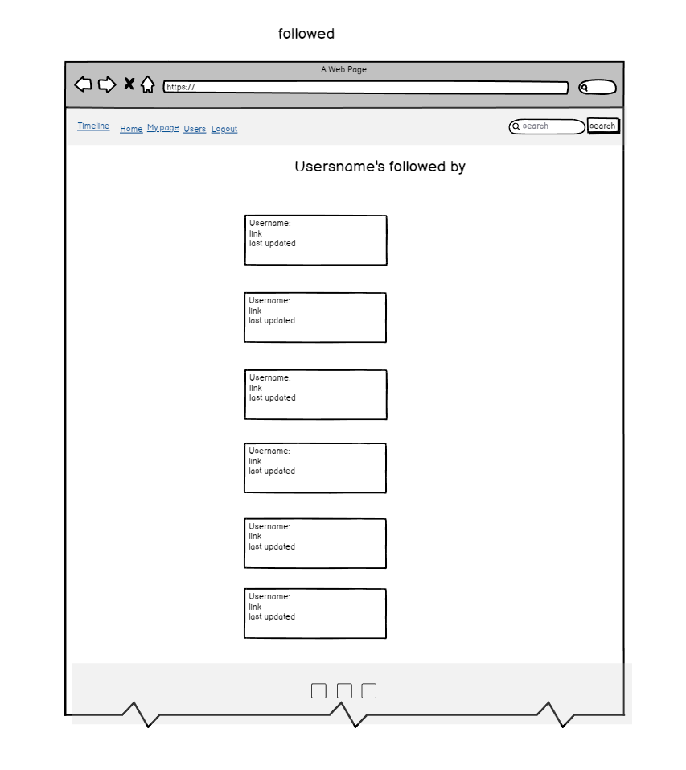
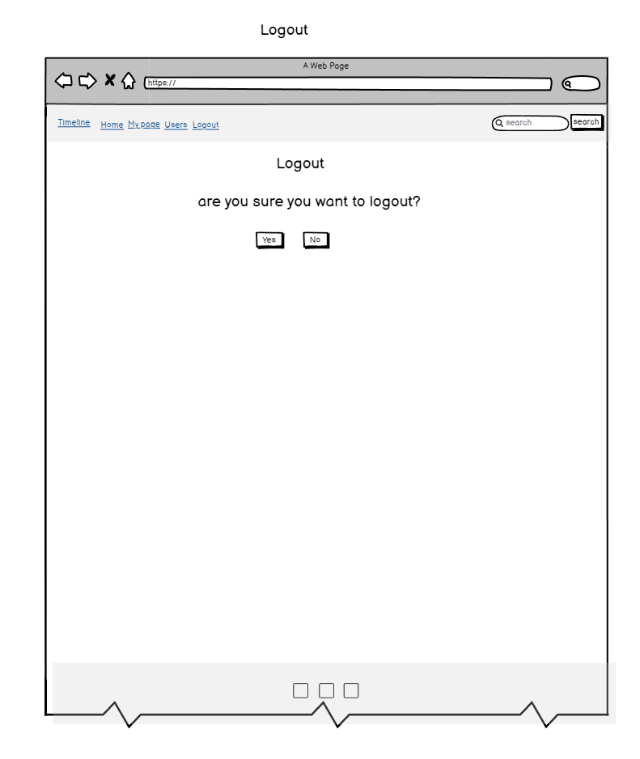

# P4-Timeline

## Project description

Timeline, a social media platform designed for users to connect, share, and engage with each other. Whether you want to keep up with your friends, share your latest updates, or discover new people, Timeline provides a streamlined and interactive experience.

[Live Site Link](https://p4-timeline-3238b4375b60.herokuapp.com/)


## Table of Contents

- [P4-Timeline](#project-name)
  - [Table of Contents](#table-of-contents)
- [User Experience Design](#user-experience-design)
  - [The Strategy Plan](#the-strategy-plan)
    - [User Stories](#user-stories)
  - [The Structure Plan](#the-structure-plan)
    - [Features](#features)
    - [Features Left to Implement](#features-left-to-implement)
  - [The Skeleton Plan](#the-skeleton-plan)
    - [Wireframes](#wireframes)
    - [Database Design](#database-design)
    - [Security](#security)
  - [The Surface Plan](#the-surface-plan)
    - [Design](#design)
    - [Color Scheme](#color-scheme)
    - [Typography](#typography)
- [Technologies](#technologies)
- [Testing](#testing)
- [Deployment](#deployment)
  - [Version Control](#version-control)
  - [Local Deployment](#local-deployment)
  - [Forking the Project](#forking-the-project)
- [Credits](#credits)

## User Experience Design

# The Strategy Plan

The overall approach was to build a full stack application using the Django framework linked to a PostgreSQL database. PostgreSQL is a popular and adaptable relational database management system and Django is a flexible framework which easily integrates APIs, allowing for a streamlined development cycle. Both are open source and well supported allowing for easy maintenance, future development, and customization. Bootstrap 5 was used at the front end to speed up the design process.

The site was designed using an Agile approach. Epics and user stories were collected, in the project GitHub repository, and prioritized according to the MOSCOW system. MOSCOW organizes stories and features into 'Must have', 'Should have', 'Could have', and 'Won't have' categories. This allows Agile developers to prioritize which parts of the program to create first. After a fixed period of time, the development cycle ends and the project is reviewed. Features may be recategorized and additional user stories added throughout based on testing and feedback received.

# Scope

The following epics and user stories were collected. Epics were broken down into user stories, additional user stories were added based on feedback.

## Epics

- Creation of a full-stack web application for managing a user timeline and interactions using Django.
- Users should have full CRUD control over their posts and comments via the front end.
- Users should be able to search for, view, and interact with other users' profiles and posts.
- The site should include user authentication, including registration, login, and logout functionalities.
- The site should display a menu.
- Development of comprehensive documentation to support maintenance and future updates of the site.

# User Stories

### Must Have

| Issue ID    | User Story |
|-------------|-------------|
| [#3](https://github.com/NiborGnu/p4-timeline/issues/3) | As a user, I want to view a timeline of posts made by me and other users so that I can stay updated on their activities. |
| [#4](https://github.com/NiborGnu/p4-timeline/issues/4) | As a user, I want to create a new post so that I can share my thoughts or updates. |
| [#5](https://github.com/NiborGnu/p4-timeline/issues/5) | As a user, I want to edit my own post so that I can correct mistakes or update content. |
| [#6](https://github.com/NiborGnu/p4-timeline/issues/6) | As a user, I want to delete my post so that I can remove it from the timeline. |
| [#7](https://github.com/NiborGnu/p4-timeline/issues/7) | As a user, I want to like or dislike a post so that I can express my opinion on the content. |
| [#8](https://github.com/NiborGnu/p4-timeline/issues/8) | As a user, I want to add a comment to a post so that I can engage with the content or author. |
| [#9](https://github.com/NiborGnu/p4-timeline/issues/9) | As a user, I want to edit or delete my comments on a post so that I can correct mistakes or remove comments. |
| [#10](https://github.com/NiborGnu/p4-timeline/issues/10) | As a user, I want to search for other users by their username so that I can find and view their profile. |
| [#11](https://github.com/NiborGnu/p4-timeline/issues/11) | As a user, I want to view my own profile so that I can see my posts and activities. |
| [#12](https://github.com/NiborGnu/p4-timeline/issues/12) | As a user, I want to view other users' profiles so that I can see their posts and activities. |
| [#13](https://github.com/NiborGnu/p4-timeline/issues/13) | As a user, I want to log out of my account so that I can leave the session securely. |
| [#15](https://github.com/NiborGnu/p4-timeline/issues/15) | As a new user, I want to register for an account so that I can start using the platform. |
| [#16](https://github.com/NiborGnu/p4-timeline/issues/16) | As a returning user, I want to log in to my account so that I can access my profile and interact with posts. |

### Should Have

| Issue ID    | User Story |
|-------------|-------------|
| [#14](https://github.com/NiborGnu/p4-timeline/issues/14) | As an unauthenticated user, I want to see a welcome message prompting me to sign up or log in so that I understand that I need an account to view the timeline. |
| [#17](https://github.com/NiborGnu/p4-timeline/issues/17) | As a user, I want to see success or error notifications after actions so that I know the outcome of my actions. |
| [#18](https://github.com/NiborGnu/p4-timeline/issues/18) | As a user, I want to view a list of my followers so that I can see who is following me. |
| [#19](https://github.com/NiborGnu/p4-timeline/issues/19) | As a user, I want to view a list of users I follow so that I can manage the people I am following. |
| [#20](https://github.com/NiborGnu/p4-timeline/issues/20) | As a user, I want to view a specific user's profile page so that I can see their posts and other profile-related information. |

### Could Have

| Issue ID    | User Story |
|-------------|-------------|
| [#21](https://github.com/NiborGnu/p4-timeline/issues/21) | As a user, I want to edit or delete my own posts on my profile so that I can update or remove my previous content. |
| [#22](https://github.com/NiborGnu/p4-timeline/issues/22) | As a user, I want to add, edit, or delete comments on posts so that I can engage with other users' content. |
| [#23](https://github.com/NiborGnu/p4-timeline/issues/23) | As a user, I want to like or dislike a post so that I can express my opinion on the content. |
| [#24](https://github.com/NiborGnu/p4-timeline/issues/24) | As a user, I want to follow or unfollow other users so that I can keep up with their posts or stop receiving updates from them. |
| [#25](https://github.com/NiborGnu/p4-timeline/issues/25) | As a user, I want to see a list of all users on the platform so that I can explore other user profiles. |

## The Structure Plan

### Features

## Social Media Webpage

The application provides a platform for users to interact through posts, comments, and likes. It enables users to view profiles, manage content, and engage with other users' posts.

### User-Friendly Interface

The design focuses on intuitive navigation and clear presentation of content, ensuring a seamless user experience. User interaction elements such as buttons and forms are straightforward and accessible.

### Responsive Design

Utilizes a responsive design framework to ensure the platform is usable and visually consistent across different devices and screen sizes, adapting seamlessly to both desktop and mobile interfaces.

### Template-Specific Features

#### index.html

- **Homepage/Landing Page NOT LOGGED IN**: You see the prompt to log in or register


- **Homepage/Landing Page LOGGED IN**: Serves as the main entry point with essential information and calls to action.
- **Hero Section**: Features a prominent section for welcoming users and highlighting key actions.
- **User Engagement**: Provides easy access to main features such as viewing profiles and managing followers/follows.
- **Introduction and Navigation**: Briefly introduces the platform and offers navigational links to other pages.


#### followers.html

- **Displays User Followers**: Lists all followers with profile pictures, usernames, and links to their profiles.
- **No Followers Message**: Shows a message when there are no followers.


#### follows.html

- **Displays User Follows**: Lists all users the current user follows, including profile pictures, usernames, and links to their profiles.
- **No Following Message**: Displays a message when no users are followed.


#### profile.html

- **Profile Display**: Shows user profile details including timeposts, followers and following.
- **Timepost Interaction**: Includes options to edit, delete, and comment on timeposts, with modals for editing and deleting comments.
- **Follow/Unfollow Button**: Allows users to follow or unfollow the profile as needed.
- **Profile Management**: Provides options for updating profile information and viewing detailed follow/followed by lists.


#### users.html

- **Displays All Users**: Lists all user profiles with profile pictures, usernames, and links to their individual profiles.
- **No Users Message**: Displays a message when no profiles are found.


### Overall Observations

- **Consistent Design**: Utilizes Bootstrap for a clean and organized presentation of user-related information. Combined with CSS and JavaScript.
- **User-Friendly Navigation**: Provides clear navigation paths and interaction options for managing user profiles and timeposts.
- **Accessibility**: Ensures a user-friendly experience with clear messages and well-structured content.


### Features Left to Implement

- Profile Picture, contact page for queries. User confirmation 

## The Skeleton Plan

### Wireframes










### Database Design

Entity relationship diagram was created using [DBVisualizer](https://www.dbvis.com/) and shows the schemas for each of the models and how they are related.


## Security

### 1. **Authentication (`@login_required` AND `request.user.is_authenticated`)**

- **Description**: The `@login_required` and `request.user.is_authenticated` decorator/if ensures that only authenticated users can access certain views, such as viewing user profiles, following/unfollowing users, and accessing followers and follows lists.
- **Purpose**: Protects sensitive actions and data from unauthorized users by redirecting them to the login page if they are not authenticated.

### 2. **Permission Checks**

- **Description**: The checks ensure that users can only access their own followers and follows pages. For instance, users are redirected if they attempt to view someone else's followers or follows page.
- **Purpose**: Prevents users from accessing or modifying data related to other users, safeguarding personal information.

### 3. **Form Validation**

- **Description**: Form submissions for actions like following or unfollowing other users are validated. This ensures that the actions performed are legitimate and intended by the user.
- **Purpose**: Prevents invalid or unauthorized actions from being processed, protecting the integrity of user interactions.

### 4. **Error Handling**

- **Description**: Error handling is implemented to manage cases where requested profiles or data do not exist. For example, using `get_object_or_404()` ensures that if a profile doesn't exist, a 404 error is raised.
- **Purpose**: Provides user-friendly feedback and prevents system errors or crashes when dealing with non-existent objects.

### 5. **Database Access Protection**

- **Description**: `get_object_or_404()` is used to ensure that the requested profile or other data exists before performing any operations.
- **Purpose**: Prevents errors and unauthorized access by ensuring that users interact with valid data.

### 6. **Input Filtering**

- **Description**: Queries are used to filter user data, such as excluding the current user from the list of users that can be followed, or filtering timeposts by the current user.
- **Purpose**: Ensures that users are only shown relevant data and interactions, preventing actions like following oneself or accessing irrelevant posts.

### 7. **Redirection After Actions**

- **Description**: After performing actions like following or unfollowing a user, users are redirected to the profile page or relevant section.
- **Purpose**: Guides users smoothly to the appropriate page after an action, enhancing user experience.


## The Surface Plan

### Design

- **Overview**: The design of this webpage prioritizes a clean and inviting aesthetic to enhance user experience. A clear layout with distinct sections ensures easy navigation and access to information. Prominently displayed call-to-action buttons encourage users to explore the menu and post a TimePost.

### Color Scheme

- **Primary Colors**:
  - **Darkgray**: `#a9a9a9` - Used for the navigation bar and footer, establishing a formal, authoritative presence that grounds the layout. Conveys a classic, respectful tone while providing a serious, gothic elegance to key structural elements.
  - **Black**: `#000000` - Used for text, offering sharp contrast for maximum readability and clarity. Conveys authority, formality, and modern sophistication.
  - **White**: `#ffffff` - Used for the background, providing a clean, open space that enhances readability and allows other elements to stand out with clarity and simplicity.

## Typography

This project uses the following typography styles:

### Fonts

1. **Roboto**  
   - **Styles**: Regular (400), Medium (500)
   - **Source**: [Google Fonts](https://fonts.googleapis.com/css2?family=Roboto:ital,wght@400;500&display=swap)

2. **SUSE**  
   - **Styles**: Varies from Thin (100) to Black (800)
   - **Source**: [Google Fonts](https://fonts.googleapis.com/css2?family=SUSE:wght@100..800&display=swap)

### Usage

To use these fonts in your project, include the following in your CSS:

```css
@import url('https://fonts.googleapis.com/css2?family=Roboto:ital,wght@400;500&family=SUSE:wght@100..800&display=swap');
```

---

## Technologies
- ### Languages:

    + [Python 3.8.5](https://www.python.org/downloads/release/    python-385/): the primary language used to develop the    server-side of the website.
    + [JS](https://www.javascript.com/): the primary language used to develop interactive components of the website.
    + [HTML](https://developer.mozilla.org/en-US/docs/Web/HTML): the markup language used to create the website.
    + [CSS](https://developer.mozilla.org/en-US/docs/Web/css): the styling language used to style the website.

- ### Frameworks and libraries:

    + [Django](https://www.djangoproject.com/): python framework used to create all the logic.

- ### Databases:

    + [SQLite](https://www.sqlite.org/): was used as a development database. 
    + [PostgreSQL](https://www.postgresql.org/): the database used to store all the data.

- ### Other tools:

    + [Git](https://git-scm.com/): the version control system used to manage the code.
    + [Pip](https://pypi.org/project/pip/): the package manager used to install the dependencies.
    + [Psycopg2](https://www.psycopg.org/): the database driver used to connect to the database.
    + [GitHub](https://github.com/): used to host the website's source code.
    + [VSCode](https://code.visualstudio.com/): the IDE used to develop the website.
    + [Chrome DevTools](https://developer.chrome.com/docs/devtools/open/): was used to debug the website.
    + [Font Awesome](https://fontawesome.com/): was used to create the icons used in the website.
    + [W3C Validator](https://validator.w3.org/): was used to validate HTML5 code for the website.
    + [W3C CSS validator](https://jigsaw.w3.org/css-validator/): was used to validate CSS code for the website.
    + [JShint](https://jshint.com/): was used to validate JS code for the website.
    + [PEP8](https://pep8.org/): was used to validate Python code for the website.


- **Bootstrap**
  - The CSS framework offering pre-designed components and a responsive grid system for layout.
- **balsamiq**
  - wireframes were created using balsamiq from https://balsamiq.com/wireframes/desktop/#

## Testing

Test cases and results can be found in the [TESTING.md](TESTING.md) file. This was moved due to the size of the file.

# Deployment

- The app was deployed to [Heroku](https://www.heroku.com/).
- The database was deployed to [ElephantSQL](https://www.elephantsql.com/).

- The app can be reached by the [link](https://p4-timeline-3238b4375b60.herokuapp.com/).

## Local deployment

*Note:*
  - This project requires to install all the requirements:
  - Open the terminal window and type:
  - `pip install -r requirements.txt`

Create a local copy of the GitHub repository by following one of the two processes below:

- Download ZIP file:
  1. Go to the [GitHub Repo page](https://github.com/NiborGnu/p4-timeline).
  1. Click the Code button and download the ZIP file containing the project.
  1. Extract the ZIP file to a location on your PC.

- Clone the repository:
  1. Open a folder on your computer with the terminal.
  1. Run the following command
  - `git clone https://github.com/NiborGnu/p4-timeline.git`

- Alternatively, if using Gitpod, you can click below to create your own workspace using this repository.

  [](https://gitpod.io/#https://github.com/NiborGnu/p4-timeline)

---

1. Install the dependencies:

    - Open the terminal window and type:
    - `pip install -r requirements.txt`


1. Create a `.gitignore` file in the root directory of the project where you should add env.py and __pycache__ files to prevent the privacy of your secret data.

1. Create a `.env` file. This will contain the following environment variables:

    ```python
    import os

      os.environ['DATABASE_URL'] = 'will be used to connect to the database'
      os.environ["SECRET_KEY"] = 'Add a secret key'
      os.environ["DEBUG"] = 'True'
      
      # Go to your database and copy this variables
      os.environ["NAME"] = ''
      os.environ["USER"] = ''
      os.environ["PASSWORD"] = ''
      os.environ["HOST"] = ''
    ```

    *During the development stage DEBUG is set to True, but it is vital to change it to False.*

1. Run the following commands in a terminal to make migrations: 
    - `python manage.py makemigrations`
    - `python manage.py migrate`
1. Create a superuser to get access to the admin environment.
    - `python manage.py createsuperuser`
    - Enter the required information (your username, email and password).
1. Run the app with the following command in the terminal:
    - `python manage.py runserver`
1. Open the link provided in a browser to see the app.

1. If you need to access the admin page:
    - Add /admin/ to the link provided.
    - Enter your username and password (for the superuser that you have created before).
    - You will be redirected to the admin page.

**The app was deployed to Heroku**

## Heroku Deployment

* Set up a local workspace on your computer for Heroku:
    - Create a list of requirements that the project needs to run:
      - type this in the terminal: `pip freeze > requirements.txt`
    - Commit and push the changes to GitHub
    
* Go to [www.heroku.com](www.heroku.com) 
* Log in or create a Heroku account.
* Create a new app with any unique name <name app>.

  

* Create a Procfile in your local workplace:

  
    
    This file will will contain the following:
    ```python
        web: gunicorn <name app>.wsgi:application
    ```
    - Commit and push the changes to GitHub.

* Go to the settings app in Heroku and go to Config Vars.

  

Click on Reveal Config Vars and add the following config variables:

| Key      | Value          |
|-------------|-------------|
| DISABLE_COLLECTSTATIC | 1 | 
| NAME | ... | 
| USER | ... |
| PASSWORD | ... |
| HOST | ... |
| SECRET_KEY | ... |
| DEBUG | ... |


* Copy the value of Database NAME, USER, PASSWORD ,HOST and input it into the .env file and generate a secret key (you may use [Djecrety](https://djecrety.ir/) for secret key generation).
* Change debug in settings.py to code below. The value of DEBUG can be set to anything do it only loks for a string in the env.py file. For easy understanding i suggest TRUE
```python
if os.path.exists('env.py'):
    import env

DEBUG = 'DEBUG' in os.environ
```
* Migrate changes.
* Commit and push the changes to GitHub.
* Connect your repository to Heroku.

  

* Deploy the app to Heroku by clicking "Deploy Branch" button. If you want to enable auto-deployment, click "Enable Automatic Deployment".

   


The deployment process will start.

   

Click "View build logs" to see the progress of the deployment.

  

**Final Deployment**

* Delete DISABLE_COLLECTSTATIC from config vars in Heroku dashboard.
* Commit and push the changes to GitHub.

### Requirements

- asgiref==3.8.1
- Django==5.1
- gunicorn==20.1.0
- psycopg2==2.9.9
- sqlparse==0.5.1
- whitenoise==6.7.0


### Version Control

The site was created using the Visual Studio Code editor and pushed to github to the remote repository.

The following git commands were used throughout development to push code to the remote repo:

```git add <file>``` - This command was used to add the file(s) to the staging area before they are committed.

```git commit -m “commit message”``` - This command was used to commit changes to the local repository queue ready for the final step.

```git push``` - This command was used to push all committed code to the remote repository on github.

### Database Creation

Made a postgresql database. And connected it.

### Forking the Project

Most commonly, forks are used to either propose changes to someone else's project or to use someone else's project as a starting point for your own idea.

- Navigate to the GitHub ([p4-Timeline](https://github.com/NiborGnu/p4-timeline)).

- On the top right of the page under the header, click the fork button.

- This will create a duplicate of the full project in your GitHub Repository.
---

## Credits

- [GitHub](https://github.com/) for giving the idea of the project's design.
- [Django](https://www.djangoproject.com/) for the framework.
- [Font awesome](https://fontawesome.com/): for the free access to icons.
- [Favicon Generator. For real.](https://realfavicongenerator.net/): for providing a free platform to generate favicons.
- [Postgresql](https://www.postgresql.org/): for providing a free database.
- [fontawesome](https://fontawesome.com/): for providing free icons.
- [googlefonts](https://fonts.google.com/): for providing free fonts.
- [Favicon Generator. For real.](https://realfavicongenerator.net/): for providing a free platform to generate favicons.
- [Code Institute](https://codeinstitute.net/se/) - For the training and classes in all the basics of HTML, CSS, JAVASCRIPT, PYTHON and more!
- Family and friends for testing and input.

