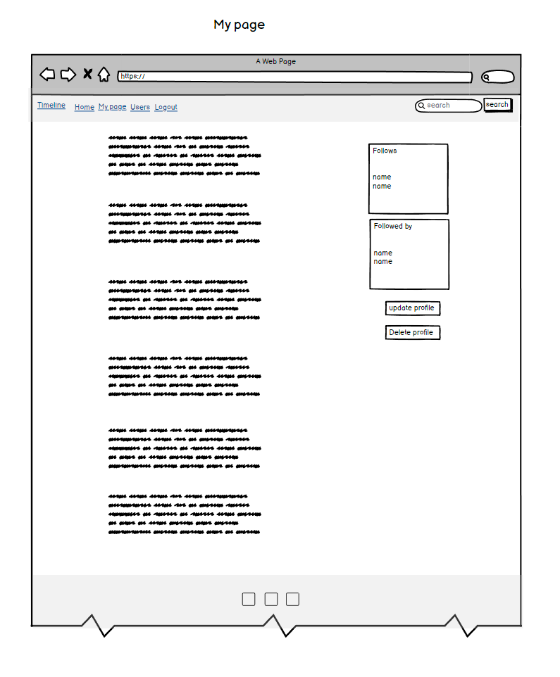
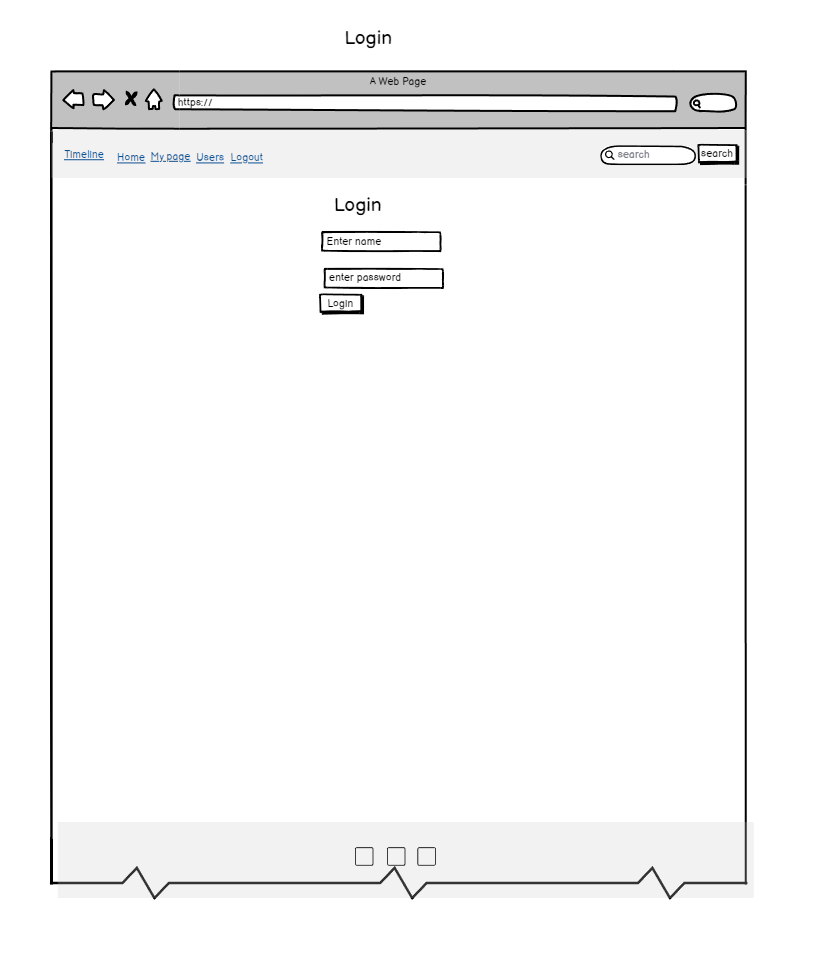
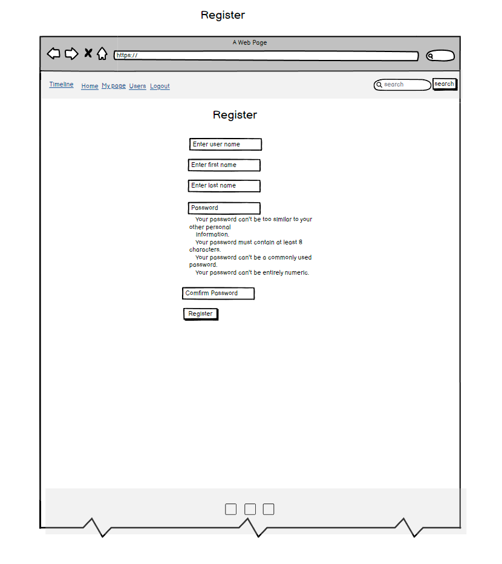

# P4-Timeline

## Project description

Timeline, a social media platform designed for users to connect, share, and engage with each other. Whether you want to keep up with your friends, share your latest updates, or discover new people, Timeline provides a streamlined and interactive experience.

[Live Site Link](https://p4-timeline-3238b4375b60.herokuapp.com/)


## Table of Contents

- [P4-Timeline](#project-name)
  - [Table of Contents](#table-of-contents)
- [User Experience Design](#user-experience-design)
  - [The Strategy Plan](#the-strategy-plan)
    - [Site Goals](#site-goals)
    - [User Stories](#user-stories)
    - [Agile Planning](#agile-planning)
  - [The Scope Plan](#the-scope-plan)
  - [The Structure Plan](#the-structure-plan)
    - [Features](#features)
    - [Features Left to Implement](#features-left-to-implement)
  - [The Skeleton Plan](#the-skeleton-plan)
    - [Wireframes](#wireframes)
    - [Database Design](#database-design)
    - [Security](#security)
  - [The Surface Plan](#the-surface-plan)
    - [Design](#design)
    - [Color Scheme](#color-scheme)
    - [Typography](#typography)
    - [Imagery](#imagery)
- [Technologies](#technologies)
- [Testing](#testing)
- [Deployment](#deployment)
  - [Version Control](#version-control)
  - [Deployment Instructions](#deployment-instructions)
  - [Run Locally](#run-locally)
  - [Forking the Project](#forking-the-project)
- [Credits](#credits)

## User Experience Design

## The Strategy Plan

### Site Goals

- Increase interaction through comments, shares, and time spent on the site.
- Ensure a seamless and intuitive navigation, reducing bounce rates.

### User Stories


#### User Story: View Followers

- **As a**: user
- **I want to**: view a list of my followers
- **So that**: I can see who is following me

- **Acceptance Criteria**:
  - 1**AC**: A list of followers is displayed, showing each follower's profile picture, username, and a link to their profile.
  - 2**AC**: If no followers exist, a message is displayed.

---

#### User Story: View Follows

- **As a**: user
- **I want to**: view a list of users I follow
- **So that**: I can manage the people I am following

- **Acceptance Criteria**:
  - 1**AC**: A list of followed users is displayed, showing each user's profile picture, username, and a link to their profile.
  - 2**AC**: If no follows exist, a message is displayed.

---

#### User Story: View User Profile

- **As a**: user
- **I want to**: view a specific user's profile page
- **So that**: I can see their posts and other profile-related information

- **Acceptance Criteria**:
  - 1**AC**: The profile page shows the user's posts (timeposts), profile picture, and follow/unfollow button.
  - 2**AC**: I can also see the user's followers and users they follow.

---

#### User Story: Edit/Delete Post on Profile

- **As a**: user
- **I want to**: edit or delete my own posts on my profile
- **So that**: I can update or remove my previous content

- **Acceptance Criteria**:
  - 1**AC**: I can edit my post using an edit form and delete it through a delete button with a confirmation modal.
  - 2**AC**: Posts are updated immediately after editing or deletion.

---

#### User Story: Comment on Posts

- **As a**: user
- **I want to**: add, edit, or delete comments on posts
- **So that**: I can engage with other users' content

- **Acceptance Criteria**:
  - 1**AC**: I can add comments, and edit or delete my own comments using buttons that trigger modals for confirmation.
  - 2**AC**: Comments show the date they were posted and the user who commented.

---

#### User Story: Like/Dislike Post

- **As a**: user
- **I want to**: like or dislike a post
- **So that**: I can express my opinion on the content

- **Acceptance Criteria**:
  - 1**AC**: Clicking like or dislike updates the respective counters.

---

#### User Story: Follow/Unfollow User

- **As a**: user
- **I want to**: follow or unfollow other users
- **So that**: I can keep up with their posts or stop receiving updates from them

- **Acceptance Criteria**:
  - 1**AC**: A follow/unfollow button is present on each user's profile, updating immediately after action.
  - 2**AC**: I can follow/unfollow from the profile or from the list of followers/followed.

---

#### User Story: View All Users

- **As a**: user
- **I want to**: see a list of all users on the platform
- **So that**: I can explore other user profiles

- **Acceptance Criteria**:
  - 1**AC**: A list of users is displayed, showing each user's profile picture, username, and a link to their profile.
  - 2**AC**: If no users are found, a message is displayed.

---

#### User Story: View Timeline

- **As a**: user
- **I want to**: view a timeline of posts made by me and other users
- **So that**: I can stay updated on their activities

- **Acceptance Criteria**:
  - 1**AC**: The timeline displays posts in reverse chronological order.
  - 2**AC**: Each post includes content, like and dislike counts, and a comment button.
  - 3**AC**: I can see who created the post and when.

---

#### User Story: Create New Post

- **As a**: user
- **I want to**: create a new post
- **So that**: I can share my thoughts or updates

- **Acceptance Criteria**:
  - 1**AC**: There is a form where I can type my post.
  - 2**AC**: After submitting, the post appears on the timeline with a timestamp.

---

#### User Story: Edit My Post

- **As a**: user
- **I want to**: edit my own post
- **So that**: I can correct mistakes or update content

- **Acceptance Criteria**:
  - 1**AC**: I can edit my post by clicking an edit button.
  - 2**AC**: Changes are saved and updated on the timeline.

---

#### User Story: Delete My Post

- **As a**: user
- **I want to**: delete my post
- **So that**: I can remove it from the timeline

- **Acceptance Criteria**:
  - 1**AC**: I can delete my post by clicking a delete button with a confirmation prompt.

---

#### User Story: Add Comment to Post

- **As a**: user
- **I want to**: add a comment to a post
- **So that**: I can engage with the content or author

- **Acceptance Criteria**:
  - 1**AC**: A button opens the comment section for each post.
  - 2**AC**: I can type and submit a comment, which appears under the post.

---

#### User Story: Edit/Delete Comment

- **As a**: user
- **I want to**: edit or delete my comments on a post
- **So that**: I can correct mistakes or remove comments

- **Acceptance Criteria**:
  - 1**AC**: I see options to edit or delete my comments.
  - 2**AC**: The comment updates after editing or is removed after deletion.

---

#### User Story: Search for Users

- **As a**: user
- **I want to**: search for other users by their username
- **So that**: I can find and view their profile

- **Acceptance Criteria**:
  - 1**AC**: A search bar allows me to enter a query.
  - 2**AC**: Results show matching users and link to their profiles.

---

#### User Story: View My Profile

- **As a**: user
- **I want to**: view my own profile
- **So that**: I can see my posts and activities

- **Acceptance Criteria**:
  - 1**AC**: A "My Profile" link in the navbar takes me to my profile with my posts and details.

---

#### User Story: View Other Users' Profiles

- **As a**: user
- **I want to**: view other users' profiles
- **So that**: I can see their posts and activities

- **Acceptance Criteria**:
  - 1**AC**: Clicking on a user’s name from their posts or comments takes me to their profile page.

---

#### User Story: Logout

- **As a**: user
- **I want to**: log out of my account
- **So that**: I can leave the session securely

- **Acceptance Criteria**:
  - 1**AC**: A "Logout" button in the navbar logs me out and redirects to the login page.

---

#### User Story: View Timeline Without Login

- **As a**: unauthenticated user
- **I want to**: see a welcome message prompting me to sign up or log in
- **So that**: I understand that I need an account to view the timeline

- **Acceptance Criteria**:
  - 1**AC**: A welcome message with login and register buttons appears.
  - 2**AC**: I cannot view the timeline unless logged in.

---

#### User Story: Register

- **As a**: new user
- **I want to**: register for an account
- **So that**: I can start using the platform

- **Acceptance Criteria**:
  - 1**AC**: A "Register" button in the navbar takes me to the registration page.
  - 2**AC**: After registration, I am redirected to the homepage and logged in.

---

#### User Story: Login

- **As a**: returning user
- **I want to**: log in to my account
- **So that**: I can access my profile and interact with posts

- **Acceptance Criteria**:
  - 1**AC**: A "Login" button in the navbar takes me to the login page.
  - 2**AC**: After logging in, I am redirected to the timeline page.

---

#### User Story: Notifications

- **As a**: user
- **I want to**: see success or error notifications after actions
- **So that**: I know the outcome of my actions

- **Acceptance Criteria**:
  - 1**AC**: I receive alerts after submitting posts, editing comments, or deleting content.
  - 2**AC**: Notifications disappear automatically or can be closed manually.

### Agile Planning

### User Management

- **Encompasses**:
  - **User Story: View Followers**
    - **As a**: user
    - **I want to**: view a list of my followers
    - **So that**: I can see who is following me
    - **Acceptance Criteria**:
      1. A list of followers is displayed, showing each follower's profile picture, username, and a link to their profile.
      2. If no followers exist, a message is displayed.

  - **User Story: View Follows**
    - **As a**: user
    - **I want to**: view a list of users I follow
    - **So that**: I can manage the people I am following
    - **Acceptance Criteria**:
      1. A list of followed users is displayed, showing each user's profile picture, username, and a link to their profile.
      2. If no follows exist, a message is displayed.

  - **User Story: Follow/Unfollow User**
    - **As a**: user
    - **I want to**: follow or unfollow other users
    - **So that**: I can keep up with their posts or stop receiving updates from them
    - **Acceptance Criteria**:
      1. A follow/unfollow button is present on each user's profile, updating immediately after action.
      2. I can follow/unfollow from the profile or from the list of followers/followed.

  - **User Story: Search for Users**
    - **As a**: user
    - **I want to**: search for other users by their username
    - **So that**: I can find and view their profile
    - **Acceptance Criteria**:
      1. A search bar allows me to enter a query.
      2. Results show matching users and link to their profiles.

  - **User Story: View Other Users' Profiles**
    - **As a**: user
    - **I want to**: view other users' profiles
    - **So that**: I can see their posts and activities
    - **Acceptance Criteria**:
      1. Clicking on a user’s name from their posts or comments takes me to their profile page.

- **Involves**:
  - Displaying user lists and profiles
  - Managing user follow relationships
  - Searching for users and navigating profiles

### Profile Management

- **Encompasses**:
  - **User Story: View User Profile**
    - **As a**: user
    - **I want to**: view a specific user's profile page
    - **So that**: I can see their posts and other profile-related information
    - **Acceptance Criteria**:
      1. The profile page shows the user's posts (timeposts), profile picture, and follow/unfollow button.
      2. I can also see the user's followers and users they follow.

  - **User Story: View My Profile**
    - **As a**: user
    - **I want to**: view my own profile
    - **So that**: I can see my posts and activities
    - **Acceptance Criteria**:
      1. A "My Profile" link in the navbar takes me to my profile with my posts and details.

  - **User Story: Edit/Delete Post on Profile**
    - **As a**: user
    - **I want to**: edit or delete my own posts on my profile
    - **So that**: I can update or remove my previous content
    - **Acceptance Criteria**:
      1. I can edit my post using an edit form and delete it through a delete button with a confirmation modal.
      2. Posts are updated immediately after editing or deletion.

  - **User Story: Edit My Post**
    - **As a**: user
    - **I want to**: edit my own post
    - **So that**: I can correct mistakes or update content
    - **Acceptance Criteria**:
      1. I can edit my post by clicking an edit button.
      2. Changes are saved and updated on the timeline.

  - **User Story: Delete My Post**
    - **As a**: user
    - **I want to**: delete my post
    - **So that**: I can remove it from the timeline
    - **Acceptance Criteria**:
      1. I can delete my post by clicking a delete button with a confirmation prompt.

- **Involves**:
  - Viewing and managing profiles and posts
  - Editing and deleting personal content

### Post Interaction

- **Encompasses**:
  - **User Story: Comment on Posts**
    - **As a**: user
    - **I want to**: add, edit, or delete comments on posts
    - **So that**: I can engage with other users' content
    - **Acceptance Criteria**:
      1. I can add comments, and edit or delete my own comments using buttons that trigger modals for confirmation.
      2. Comments show the date they were posted and the user who commented.

  - **User Story: Like/Dislike Post**
    - **As a**: user
    - **I want to**: like or dislike a post
    - **So that**: I can express my opinion on the content
    - **Acceptance Criteria**:
      1. Clicking like or dislike updates the respective counters.

  - **User Story: Add Comment to Post**
    - **As a**: user
    - **I want to**: add a comment to a post
    - **So that**: I can engage with the content or the author
    - **Acceptance Criteria**:
      1. A button opens the comment section for each post.
      2. I can type and submit a comment, which appears under the post.

  - **User Story: Edit/Delete Comment**
    - **As a**: user
    - **I want to**: edit or delete my comments on a post
    - **So that**: I can correct mistakes or remove comments
    - **Acceptance Criteria**:
      1. I see options to edit or delete my comments.
      2. The comment updates after editing or is removed after deletion.

- **Involves**:
  - Interacting with posts through comments and reactions
  - Managing comments on posts

### Content Management

- **Encompasses**:
  - **User Story: Create New Post**
    - **As a**: user
    - **I want to**: create a new post
    - **So that**: I can share my thoughts or updates
    - **Acceptance Criteria**:
      1. There is a form where I can type my post.
      2. After submitting, the post appears on the timeline with a timestamp.

  - **User Story: Edit My Post**
    - **As a**: user
    - **I want to**: edit my own post
    - **So that**: I can correct mistakes or update content
    - **Acceptance Criteria**:
      1. I can edit my post by clicking an edit button.
      2. Changes are saved and updated on the timeline.

- **Involves**:
  - Creating and updating posts on the platform

### Timeline Management

- **Encompasses**:
  - **User Story: View Timeline**
    - **As a**: user
    - **I want to**: view the timeline of posts made by other users
    - **So that**: I can stay updated on their activities
    - **Acceptance Criteria**:
      1. The timeline displays posts in reverse chronological order.
      2. Each post includes content, like and dislike counts, and a comment button.
      3. I can see who created the post and when.

  - **User Story: View Timeline Without Login**
    - **As a**: unauthenticated user
    - **I want to**: see a welcome message prompting me to sign up or log in
    - **So that**: I understand that I need an account to view the timeline
    - **Acceptance Criteria**:
      1. A welcome message with login and register buttons appears.
      2. I cannot view the timeline unless logged in.

- **Involves**:
  - Displaying posts on a timeline for logged-in users and not for unauthenticated users

### Authentication and Authorization

- **Encompasses**:
  - **User Story: Register**
    - **As a**: new user
    - **I want to**: register for an account
    - **So that**: I can start using the platform
    - **Acceptance Criteria**:
      1. A "Register" button in the navbar takes me to the registration page.
      2. After registration, I am redirected to the homepage and logged in.

  - **User Story: Login**
    - **As a**: returning user
    - **I want to**: log in to my account
    - **So that**: I can access my profile and interact with posts
    - **Acceptance Criteria**:
      1. A "Login" button in the navbar takes me to the login page.
      2. After logging in, I am redirected to the timeline page.

  - **User Story: Logout**
    - **As a**: user
    - **I want to**: log out of my account
    - **So that**: I can leave the session securely
    - **Acceptance Criteria**:
      1. A "Logout" button in the navbar logs me out and redirects to the login page.

- **Involves**:
  - User registration, login, and logout processes

### Notifications

- **Encompasses**:
  - **User Story: Notifications**
    - **As a**: user
    - **I want to**: see success or error notifications after actions
    - **So that**: I know the outcome of my actions
    - **Acceptance Criteria**:
      1. I receive alerts after submitting posts, editing comments, or deleting content.
      2. Notifications disappear automatically or can be closed manually.

- **Involves**:
  - Providing feedback to users on their actions and system status

These stories involve:
-Backend functionality for administrators to control various aspects of the Timeline operations and user data

### Why These are Epics

- **Complexity**: They involve multiple interconnected features and functionalities, likely requiring more development effort than a single user story.
- **Scope**: They represent broader user goals rather than specific, isolated actions.

## The Scope Plan

- **Management:**
  - **Superuser**: Can edit and delete all comments, Timeposts. Can delete users from webpage.

- **User Authentication and Management:**
  - **Register**: New users can sign up for an account.
  - **Login/Logout**: Users can log into and out of their accounts.

- **User Profiles:**
  - **View Profile**: Users can view their own and other users' profiles.
  - **Edit Profile**: Users can edit their own posts and profile information.

- **Post Interaction:**
  - **Create Post**: Users can create new posts.
  - **Edit/Delete Post**: Users can edit or delete their own posts.
  - **Like/Dislike Post**: Users can express opinions on posts through likes or dislikes.

- **Comment Management:**
  - **Add/Edit/Delete Comment**: Users can add, edit, or delete comments on posts.

- **Timeline and Content Viewing:**
  - **View Timeline**: Users can view a timeline of posts from users they follow.
  - **View Timeline Without Login**: Unauthenticated users are shown a welcome message prompting them to log in or register.

- **User Interaction:**
  - **Follow/Unfollow Users**: Users can follow or unfollow other users to manage their feed.

## The Structure Plan

### Features

## Social Media Webpage

The application provides a platform for users to interact through posts, comments, and likes. It enables users to view profiles, manage content, and engage with other users' posts.

### User-Friendly Interface

The design focuses on intuitive navigation and clear presentation of content, ensuring a seamless user experience. User interaction elements such as buttons and forms are straightforward and accessible.

### Responsive Design

Utilizes a responsive design framework to ensure the platform is usable and visually consistent across different devices and screen sizes, adapting seamlessly to both desktop and mobile interfaces.

### Template-Specific Features

#### index.html

- **Homepage/Landing Page NOT LOGGED IN**: You see the prompt to log in or register


- **Homepage/Landing Page LOGGED IN**: Serves as the main entry point with essential information and calls to action.
- **Hero Section**: Features a prominent section for welcoming users and highlighting key actions.
- **User Engagement**: Provides easy access to main features such as viewing profiles and managing followers/follows.
- **Introduction and Navigation**: Briefly introduces the platform and offers navigational links to other pages.


#### followers.html

- **Displays User Followers**: Lists all followers with profile pictures, usernames, and links to their profiles.
- **No Followers Message**: Shows a message when there are no followers.


#### follows.html

- **Displays User Follows**: Lists all users the current user follows, including profile pictures, usernames, and links to their profiles.
- **No Following Message**: Displays a message when no users are followed.


#### profile.html

- **Profile Display**: Shows user profile details including timeposts, followers and following.
- **Timepost Interaction**: Includes options to edit, delete, and comment on timeposts, with modals for editing and deleting comments.
- **Follow/Unfollow Button**: Allows users to follow or unfollow the profile as needed.
- **Profile Management**: Provides options for updating profile information and viewing detailed follow/followed by lists.


#### users.html

- **Displays All Users**: Lists all user profiles with profile pictures, usernames, and links to their individual profiles.
- **No Users Message**: Displays a message when no profiles are found.


### Overall Observations

- **Consistent Design**: Utilizes Bootstrap for a clean and organized presentation of user-related information. Combined with CSS and JavaScript.
- **User-Friendly Navigation**: Provides clear navigation paths and interaction options for managing user profiles and timeposts.
- **Accessibility**: Ensures a user-friendly experience with clear messages and well-structured content.


### Features Left to Implement

- Profile Picture, contact page for queries. User confirmation 

## The Skeleton Plan

### Wireframes









### Database Design

Entity relationship diagram was created using [DBVisualizer](https://www.dbvis.com/) and shows the schemas for each of the models and how they are related.


## Security

### 1. **Authentication (`@login_required` AND `request.user.is_authenticated`)**

- **Description**: The `@login_required` and `request.user.is_authenticated` decorator/if ensures that only authenticated users can access certain views, such as viewing user profiles, following/unfollowing users, and accessing followers and follows lists.
- **Purpose**: Protects sensitive actions and data from unauthorized users by redirecting them to the login page if they are not authenticated.

### 2. **Permission Checks**

- **Description**: The checks ensure that users can only access their own followers and follows pages. For instance, users are redirected if they attempt to view someone else's followers or follows page.
- **Purpose**: Prevents users from accessing or modifying data related to other users, safeguarding personal information.

### 3. **Form Validation**

- **Description**: Form submissions for actions like following or unfollowing other users are validated. This ensures that the actions performed are legitimate and intended by the user.
- **Purpose**: Prevents invalid or unauthorized actions from being processed, protecting the integrity of user interactions.

### 4. **Error Handling**

- **Description**: Error handling is implemented to manage cases where requested profiles or data do not exist. For example, using `get_object_or_404()` ensures that if a profile doesn't exist, a 404 error is raised.
- **Purpose**: Provides user-friendly feedback and prevents system errors or crashes when dealing with non-existent objects.

### 5. **Database Access Protection**

- **Description**: `get_object_or_404()` is used to ensure that the requested profile or other data exists before performing any operations.
- **Purpose**: Prevents errors and unauthorized access by ensuring that users interact with valid data.

### 6. **Input Filtering**

- **Description**: Queries are used to filter user data, such as excluding the current user from the list of users that can be followed, or filtering timeposts by the current user.
- **Purpose**: Ensures that users are only shown relevant data and interactions, preventing actions like following oneself or accessing irrelevant posts.

### 7. **Redirection After Actions**

- **Description**: After performing actions like following or unfollowing a user, users are redirected to the profile page or relevant section.
- **Purpose**: Guides users smoothly to the appropriate page after an action, enhancing user experience.


## The Surface Plan

### Design

- **Overview**: The design of this webpage prioritizes a clean and inviting aesthetic to enhance user experience. A clear layout with distinct sections ensures easy navigation and access to information. Prominently displayed call-to-action buttons encourage users to explore the menu and post a TimePost.

### Color Scheme

- **Primary Colors**:
  - **Darkgray**: `#a9a9a9` - Used for the navigation bar and footer, establishing a formal, authoritative presence that grounds the layout. Conveys a classic, respectful tone while providing a serious, gothic elegance to key structural elements.
  - **Black**: `#000000` - Used for text, offering sharp contrast for maximum readability and clarity. Conveys authority, formality, and modern sophistication.
  - **White**: `#ffffff` - Used for the background, providing a clean, open space that enhances readability and allows other elements to stand out with clarity and simplicity.

### Typography

- HTML
  - The structure of the Website was developed using HTML as the main language.
- CSS
  - The Website was styled using custom CSS in an external file.
- Python
  - Python was the main programming language used for the application using the Django Framework.
- JavaScript
  - JavaScript was used to enhance the interactivity and functionality of the Website, handling client-side scripting and dynamic content.
- Visual Studio Code
  - The website was developed using Visual Studio Code IDE
- GitHub
  - Source code is hosted on GitHub
- Git
  - Used to commit and push code during the development of the Website
- Font Awesome
  - This was used for various icons throughout the site
- Favicon.io
  - favicon files were created at https://favicon.io/favicon-converter/
- balsamiq
  - wireframes were created using balsamiq from https://balsamiq.com/wireframes/desktop/#

## Python Modules Used

- Django function-based views (ListView, UpdateView, DeleteView, CreateView) - Used for the classes to create, read, update and delete.
- messages - Used to pass messages to display feedback to the user upon actions

## External Python Modules

- asgiref==3.8.1
- Django==5.1
- gunicorn==20.1.0
- psycopg2==2.9.9
- sqlparse==0.5.1
- whitenoise==6.7.0


## Technologies

- **Python**
  - The primary programming language used for the Django backend.
- **Django**
  - The high-level web framework that powers the application's structure and logic.
- **HTML**
  - The markup language used to structure the web pages.
- **CSS**
  - The styling language for defining the visual appearance of the web pages.
- **Bootstrap**
  - The CSS framework offering pre-designed components and a responsive grid system for layout.
- **Visual Studio Code**
  - The website was developed using Visual Studio Code IDE
- **GitHub**
  - Source code is hosted on GitHub
- **Git**
  - Used to commit and push code during the development of the Website
- **Font Awesome**
  - This was used for various icons throughout the site
- **Favicon.io**
  - favicon files were created at https://favicon.io/favicon-converter/
- **balsamiq**
  - wireframes were created using balsamiq from https://balsamiq.com/wireframes/desktop/#

## Testing

Test cases and results can be found in the [TESTING.md](TESTING.md) file. This was moved due to the size of the file.

## Deployment

### Version Control

The site was created using the Visual Studio Code editor and pushed to github to the remote repository.

The following git commands were used throughout development to push code to the remote repo:

```git add <file>``` - This command was used to add the file(s) to the staging area before they are committed.

```git commit -m “commit message”``` - This command was used to commit changes to the local repository queue ready for the final step.

```git push``` - This command was used to push all committed code to the remote repository on github.

### Deployment Instructions

### Database Creation

Made a postgresql database. And connected it.

### Heroku Deployment

The site was deployed to Heroku. The steps to deploy are as follows:

- Navigate to heroku and create an account
- Click the new button in the top right corner
- Select create new app
- Enter app name
- Select region and click create app
- Click the resources tab and search for Heroku Postgres
- Select hobby dev and continue
- Go to the settings tab and then click reveal config vars
- Add the following config vars:
  - SECRET_KEY: (Your secret key)
  - DATABASE: (Look at database creation)
      - NAME
      - USER
      - PASSWORD
      - HOST
- Click the deploy tab
- Scroll down to Connect to GitHub and sign in / authorize when prompted
- In the search box, find the repositoy you want to deploy and click connect
- Scroll down to Manual deploy and choose the main branch
- Click deploy

### Run Locally

Navigate to the GitHub ([p4-Timeline](https://github.com/NiborGnu/p4-timeline)):

- Click on the code drop down button
- Click on HTTPS
- Copy the repository link to the clipboard
- Open your IDE of choice (git must be installed for the next steps)
- Type git clone copied-git-url into the IDE terminal

The project will now have been cloned on your local machine for use.

### Forking the Project

Most commonly, forks are used to either propose changes to someone else's project or to use someone else's project as a starting point for your own idea.

- Navigate to the GitHub ([p4-Timeline](https://github.com/NiborGnu/p4-timeline)).

- On the top right of the page under the header, click the fork button.

- This will create a duplicate of the full project in your GitHub Repository.

## Credits

- Google.
- Family and friends for testing and input.

+ #### Inspiration
  * [Code Institute](https://codeinstitute.net/se/) - For the training and classes in all the basics of HTML, CSS, JAVASCRIPT, PYTHON and more!
  * [Fontawesome](https://fontawesome.com/search?q=more&o=r&m=free) - For the nice Icons I have been using that they have
