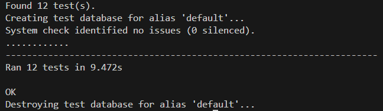
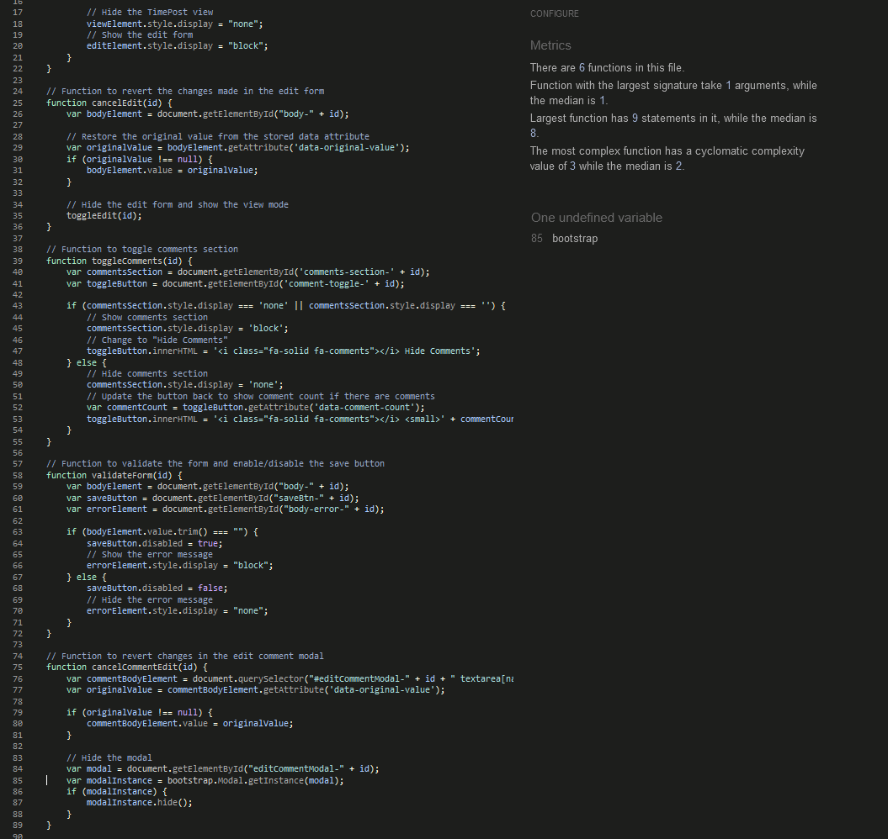

# Functional Testing

| Description      | Steps                                                                                                                                           | Expected                                                                       | Actual                                                                         | Pass |
| ---------------- | ----------------------------------------------------------------------------------------------------------------------------------------------- | ------------------------------------------------------------------------------ | ------------------------------------------------------------------------------ | ---- |
| open website     | open website                                                                                                                                    | Homepage                                                                       | Homepage                                                                       | Pass |
| View menu        | Press menu in navbar                                                                                                                            | Menu view                                                                      | Menu view                                                                      | Pass |
| Type a TimePost     | Write in text filed and push Timepost navbar                                                                                                                    | Timepost Made. Confirmation message                                                                   | Timepost Made. Confirmation message                                                                   | Pass |
| Edit a Timepost   | Go to my edit icon, select the post you want to edit, Press edit, edit what you want and submit                  | See Timepost updated message and timepost updated   | See Timepost updated message and timepost updated   | Pass |
| Delete a booking | Go to my homepage or my page, select the timepost you want to delete, Press delete, press Delete on message | See deleted message                                | See deleted message                               | Pass |
| Make account     | Press register, type in your preferred username, first name, last name, email and password                                             | See message on home page You have successfully registered! Welcome!                    | See message on home page You have successfully registered! Welcome!                    | Pass |
| login            | press login in navbar then input you username and password              |  Se the logged in homepage and message You have successfully logged in            | Se the logged in homepage and message You have successfully logged in              | Pass   |
| logout           | Press logout in navbar then sign out                                                                                                            | See message you have signed out                                                | See message you have signed out                                                | Pass |

## Navigation links

Testing was performed to ensure all navigation links on the respective pages, navigated to the correct pages as per design. This was done by clicking on the navigation links on each page.

- See markdown testing above for navigation links and how they work

All navigation links directed to the correct pages as expected.

## Footer

Testing was performed on the footer links by clicking the font awesome icons and ensuring that the github icon opened github in a new tab and the linkedin icon opened linkedin and the youtube icon opened youtube in a new tab. These behaved as expected.

## Negative Testing

Tests were performed on the `TimePost` creation to ensure that:

1. **Empty TimePost**: A user cannot post an empty `TimePost`.  
   **Error message**: "You must enter content before posting."

2. **Unauthorized Posting**: Guests (not logged in) cannot create a `TimePost`.  
   **Error message**: "You must be logged in to create a post."

3. **Exceeding Character Limit**: A user cannot post content exceeding 400 characters.  
   **Error message**: "Content cannot exceed 400 characters."

4. **Empty Required Fields**: Users cannot submit the form with required fields left empty.  
   **Error message**: "This field is required."

## Unit Testing

Unit tests were created to test some basic functionality such as templates used and redirects. These can be found in the tests.py files in the respective apps.

Results:

## Accessibility

[Wave Accessibility](https://wave.webaim.org/) tool was used throughout development and for final testing of the deployed website to check for any aid accessibility testing.

Testing was focused to ensure the following criteria were met:

- All forms have associated labels or aria-labels so that this is read out on a screen reader to users who tab to form inputs
- Color contrasts meet a minimum ratio as specified in [WCAG 2.1 Contrast Guidelines](https://www.w3.org/WAI/WCAG21/Understanding/contrast-minimum.html)
- Heading levels are not missed or skipped to ensure the importance of content is relayed correctly to the end user
- All content is contained within landmarks to ensure ease of use for assistive technology, allowing the user to navigate by page regions
- All not textual content had alternative text or titles so descriptions are read out to screen readers
- HTML page lang attribute has been set
- Aria properties have been implemented correctly
- WCAG 2.1 Coding best practices being followed

## Validator Testing

All pages were run through the [w3 HTML Validator](https://validator.w3.org/). Initially there were some errors due to stray script tags, misuse of headings within spans and some unclosed elements. All of these issues were corrected and all pages passed validation.

Due to the django templating language code used in the HTML files, these could not be copy and pasted into the validator and due to the secured views, pages with login required or a secured view cannot be validated by direct URI. To test the validation on the files, open the page to validate, right click and view page source. Paste the raw html code into the validator as this will be only the HTML rendered code.

## Styling

CSS was run through the offical [jigsaw_validator](https://jigsaw.w3.org/css-validator/) to ensure that the styling is correct and working all throughout the site.

JS was run through the offical [jshint_validator](https://jshint.com/) to ensure that the JavaScript functions is correct and working.

All pages were run through the Code institute's [Pep8](https://pep8ci.herokuapp.com/#) validator to ensure all code was pep8 compliant. Some errors were shown due to blank spacing and lines too long, 1 line instead of 2 expected. All of these errors were resolved and code passed through validators with the exception of the settings.py file.

## Lighthouse Report

Lighthouse report showed good results.

## Responsiveness

All pages were tested to ensure responsiveness on screen sizes from 360px and upwards as defined in WCAG 2.1 Reflow criteria for responsive design on Chrome, Edge, Firefox and Opera browsers.

Steps to test:

- Open browser and navigate to [Timeline](https://p4-timeline-3238b4375b60.herokuapp.com/)
- Open the developer tools (right click and inspect)
- Set to responsive and decrease width to 360px
- Set the zoom to 50%
- Click and drag the responsive window to maximum width

Expected:

Website is responsive on all screen sizes and no images are pixelated or stretched. No horizontal scroll is present. No elements overlap.

Actual:

Website behaved as expected.

Website was also opened on the following devices and no responsive issues were seen:

Iphone 13
IPhone 15

## Bugs
